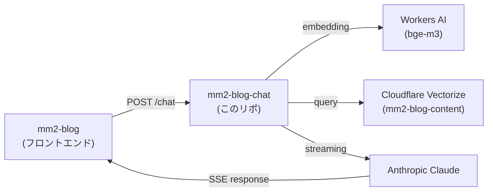

# mm2-blog-chat

[mm2-blog](https://github.com/milkmaccya2/mm2-blog) のAIチャットバックエンド。ブログの内容についてRAGベースで回答するCloudflare Worker。

## ドメイン情報

- **本番URL**: [https://chat.milkmaccya.com](https://chat.milkmaccya.com)
- **Cloudflare Workers (デフォルト)**: [https://mm2-blog-chat.milkmaccya2.workers.dev/](https://mm2-blog-chat.milkmaccya2.workers.dev/)

## アーキテクチャ



## 開発コマンド

| コマンド | 説明 |
| :--- | :--- |
| `npm install` | 依存関係のインストール |
| `npm run dev` | ローカルサーバー起動 (`localhost:8787`) |
| `npm run deploy` | Cloudflare Workers にデプロイ |
| `npm run lint` | Biomeでコードチェック |
| `npm run lint:fix` | Biomeでコードチェック＆自動修正 |

## プロジェクト構成

```text
├── src/
│   ├── index.ts            # POST /chat, POST /ingest エンドポイント (CORS対応)
│   ├── ingest-handler.ts   # /ingest 処理 (embedding + Vectorize upsert)
│   ├── rag.ts              # Vectorize検索 + コンテキスト生成
│   ├── system-prompt.ts    # LLMシステムプロンプト
│   ├── types.ts            # 共有型定義 (Chunk)
│   └── constants.ts        # Embeddingモデル定数
├── scripts/
│   ├── chunker.ts          # Markdownチャンク分割
│   ├── ingest.ts           # ブログ記事→チャンクJSON生成
│   ├── note-fetcher.ts     # note.com記事取得
│   └── wrangler-ingest.json  # (旧) ingest Worker用wrangler設定
├── .github/workflows/
│   └── ingest.yml          # Ingest自動実行ワークフロー
├── wrangler.json           # メインWorker設定
├── biome.json              # Biome設定（Lint/Format）
└── package.json
```

## 技術スタック

- Cloudflare Workers (ランタイム)
- AI SDK (`@ai-sdk/anthropic`, `ai`)
- Cloudflare Vectorize (ベクトル検索)
- Cloudflare Workers AI (bge-m3 embedding)
- Biome (Linter/Formatter)

## 環境変数

ローカル開発には `.dev.vars` ファイルが必要です。

```bash
echo "ANTHROPIC_API_KEY=sk-ant-your-api-key-here" > .dev.vars
```

| 変数名 | 説明 |
| :--- | :--- |
| `ANTHROPIC_API_KEY` | Anthropic APIキー (`wrangler secret put` で設定) |
| `INGEST_SECRET` | `/ingest` エンドポイントの認証トークン (`wrangler secret put` で設定) |

## データ取り込み (Ingest)

ブログ記事のチャンク生成 → embedding → Vectorize upsert までを自動化しています。

### 自動実行 (GitHub Actions)

`.github/workflows/ingest.yml` により以下のタイミングで自動実行されます:

- **手動**: GitHub Actions の「Run workflow」ボタン
- **自動**: mm2-blog リポジトリから `repository_dispatch` イベント (`blog-updated`) を送信

#### 初回セットアップ

```bash
# シークレット生成 & Cloudflare Workers に設定
openssl rand -hex 32 | tee /tmp/ingest_secret.txt | npx wrangler secret put INGEST_SECRET

# 同じ値を GitHub Secrets に設定 (Actions から /ingest を叩くために必要)
gh secret set INGEST_SECRET < /tmp/ingest_secret.txt

rm /tmp/ingest_secret.txt

# デプロイ
npm run deploy
```

### ローカル手動実行

```bash
# 1. チャンクJSONを生成
BLOG_DIR=../mm2-blog/src/content/blog npm run ingest:prepare

# 2. デプロイ済みエンドポイントにアップロード
curl -X POST https://chat.milkmaccya.com/ingest \
  -H "Content-Type: application/json" \
  -H "Authorization: Bearer <INGEST_SECRET>" \
  -d @/tmp/chunks.json
```

## CORS

以下のオリジンからのリクエストを許可:

- `https://blog.milkmaccya.com` (本番)
- `*-mm2-blog.milkmaccya2.workers.dev` (PRプレビュー)
