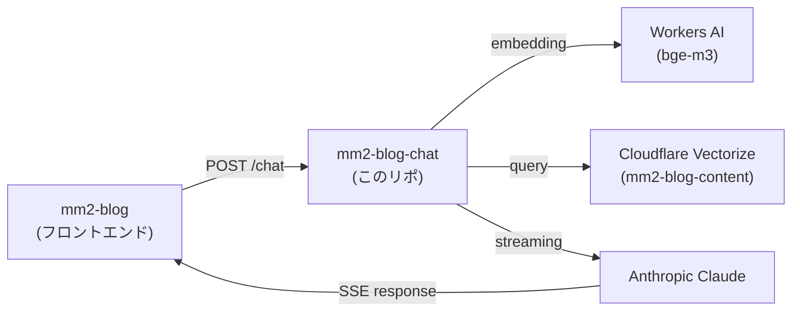

# mm2-blog-chat

[mm2-blog](https://github.com/milkmaccya2/mm2-blog) のAIチャットバックエンド。ブログの内容についてRAGベースで回答するCloudflare Worker。

## ドメイン情報

- **本番URL**: [https://chat.milkmaccya.com](https://chat.milkmaccya.com)
- **Cloudflare Workers (デフォルト)**: [https://mm2-blog-chat.milkmaccya2.workers.dev/](https://mm2-blog-chat.milkmaccya2.workers.dev/)

## アーキテクチャ



## 開発コマンド

| コマンド | 説明 |
| :--- | :--- |
| `npm install` | 依存関係のインストール |
| `npm run dev` | ローカルサーバー起動 (`localhost:8787`) |
| `npm run deploy` | Cloudflare Workers にデプロイ |
| `npm run lint` | Biomeでコードチェック |
| `npm run lint:fix` | Biomeでコードチェック＆自動修正 |

## プロジェクト構成

```text
├── src/
│   ├── index.ts          # POST /chat エンドポイント (CORS対応)
│   ├── rag.ts            # Vectorize検索 + コンテキスト生成
│   ├── system-prompt.ts  # LLMシステムプロンプト
│   └── constants.ts      # Embeddingモデル定数
├── scripts/
│   ├── chunker.ts        # Markdownチャンク分割
│   ├── ingest.ts         # ブログ記事→チャンクJSON生成
│   ├── ingest-worker.ts  # embedding + Vectorize upsert Worker
│   ├── note-fetcher.ts   # note.com記事取得
│   └── wrangler-ingest.json  # ingest Worker用wrangler設定
├── wrangler.json         # メインWorker設定
├── biome.json            # Biome設定（Lint/Format）
└── package.json
```

## 技術スタック

- Cloudflare Workers (ランタイム)
- AI SDK (`@ai-sdk/anthropic`, `ai`)
- Cloudflare Vectorize (ベクトル検索)
- Cloudflare Workers AI (bge-m3 embedding)
- Biome (Linter/Formatter)

## 環境変数

ローカル開発には `.dev.vars` ファイルが必要です。

```bash
echo "ANTHROPIC_API_KEY=sk-ant-your-api-key-here" > .dev.vars
```

| 変数名 | 説明 |
| :--- | :--- |
| `ANTHROPIC_API_KEY` | Anthropic APIキー (`wrangler secret put` で設定) |

## データ取り込み (Ingest)

ブログ記事をVectorizeにインデックスする手順:

```bash
# 1. チャンクJSONを生成 (ブログリポのパスを指定)
BLOG_DIR=../mm2-blog/src/content/blog/weekly npm run ingest:prepare

# 2. ingest Workerをローカル起動 (--remote でVectorizeに接続)
npx wrangler dev scripts/ingest-worker.ts -c scripts/wrangler-ingest.json --remote

# 3. チャンクをアップロード
curl -X POST http://localhost:8787 -H "Content-Type: application/json" -d @/tmp/chunks.json
```

## CORS

以下のオリジンからのリクエストを許可:

- `https://blog.milkmaccya.com` (本番)
- `*-mm2-blog.milkmaccya2.workers.dev` (PRプレビュー)
